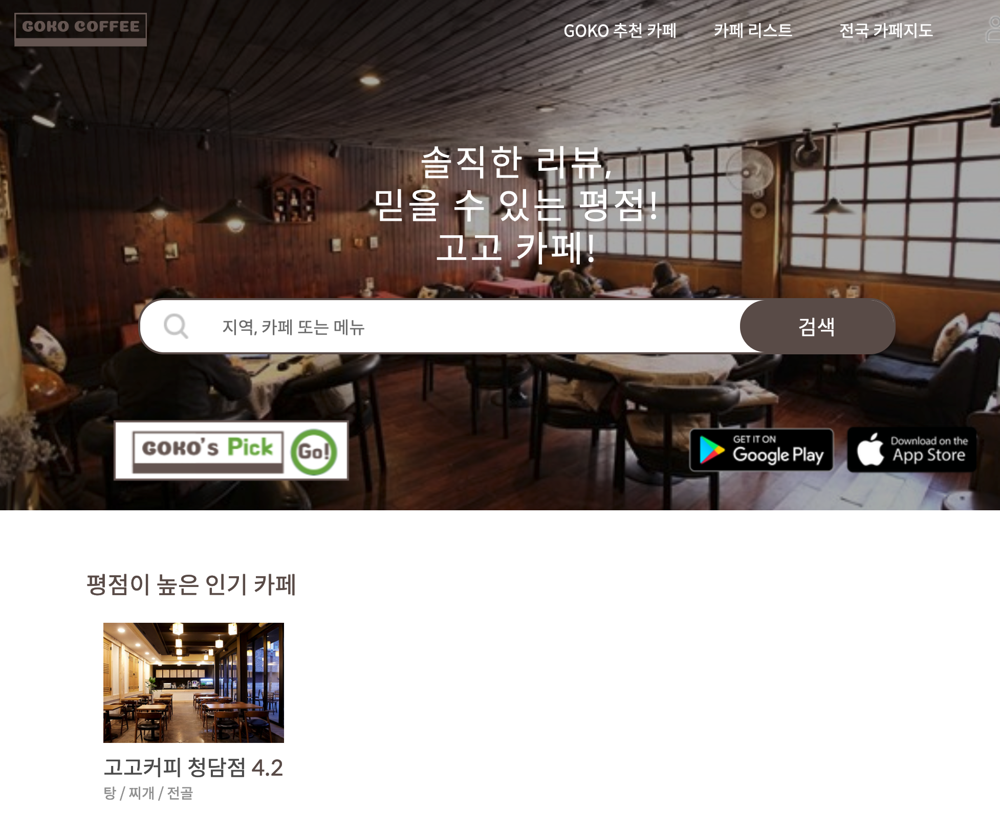
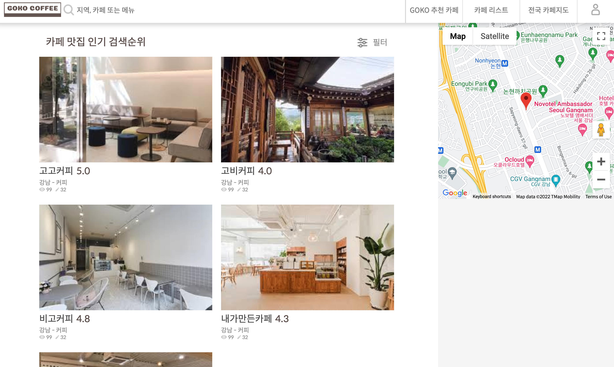
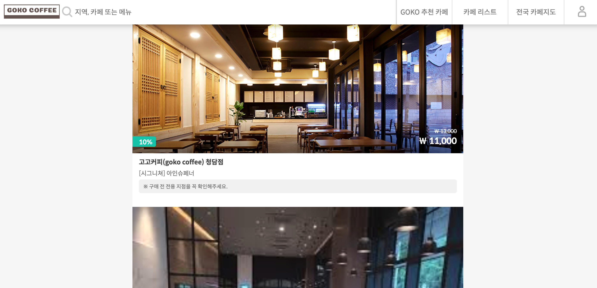
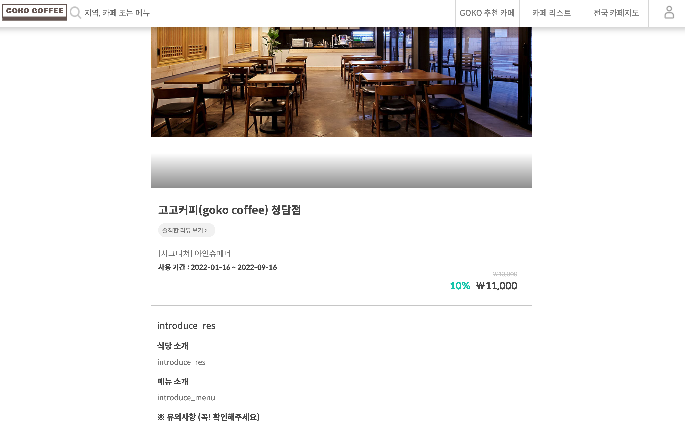

  

# `goko coffee`  
goko coffee is a community of cafe lovers  
this is a front-end on reactjs

## snap shots  
  
  
  
  

## mainly dependency  
| no.|library|dependency|  
|---|---|---|  
|1|react|v16.6.3|  
|2|sass|v1.54.6|  
|3|axios|v0.18.0|  

## run
npm install  
npm start  

localhost:3000  
